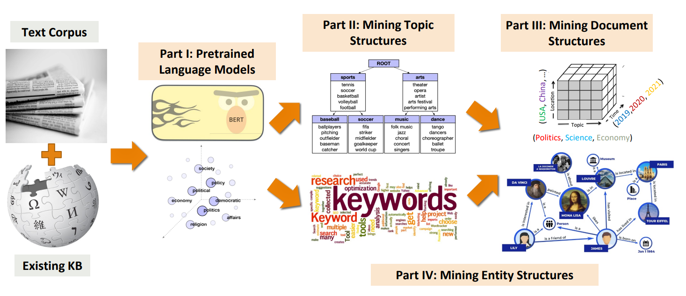

<h2 align="center">EDBT'23 Tutorial: Mining Structures from Massive Texts by Exploring the Power of Pre-trained Language Models</h2>

<h4 align="center">Yu Zhang, Yunyi Zhang, and Jiawei Han</h4>
<h4 align="center">Time: March 29th, 2023 11:00 AM - 12:30 PM and 16:00 PM - 17:30 PM (UTC+2)</h4>

## Abstract
Technologies for handling massive structured or semi-structured data have been researched extensively in database communities.
However, the real-world data are largely in the form of unstructured text, posing a great challenge to their management and analysis as well as their integration with semi-structured databases.
Recent developments of deep learning methods and large pre-trained language models (PLMs) have revolutionized text mining and processing and shed new light on structuring massive text data and building a framework for integrated (i.e., structured and unstructured) data management and analysis.

In this tutorial, we will focus on the recently developed text mining approaches empowered by PLMs that can work without relying on heavy human annotations. We will present an organized picture of how a set of weakly supervised methods explore the power of PLMs to structure text data, with the following outline:

(1) **An introduction to pre-trained language models** that serve as new tools for our tasks;

(2) **Mining topic structures**: unsupervised and seed-guided methods for topic discovery from massive text corpora;

(3) **Mining document structures**: weakly supervised methods for text classification;

(4) **Mining entity structures**: distantly supervised and weakly supervised methods for phrase mining, named entity recognition, taxonomy construction, and structured knowledge graph construction;

(5) **Towards an integrated information processing paradigm**.

## Slides
- Introduction [[Slides](edbt2023_part0.pdf)]
- Part I: Pre-trained Language Models [[Slides](edbt2023_part1.pdf)]
- Part II: Mining Topic Structures: Unsupervised and Seed-Guided Topic Discovery [[Slides](edbt2023_part2.pdf)]
- Part III: Mining Document Structures: Weakly Supervised Text Classification [[Slides](edbt2023_part3.pdf)]
- Part IV: Mining Entity Structures: Taxonomy and Knowledge Base Construction [[Slides](edbt2023_part4.pdf)]
- Summary: Towards an Integrated Information Processing Paradigm [[Slides](edbt2023_part5.pdf)]

## Presenters
- **Yu Zhang** is a Ph.D. candidate in Computer Science from UIUC. His research focuses on weakly supervised text mining with structural information. He received the Yunni & Maxine Pao Memorial Fellowship (2022) and WWW Best Poster Award Honorable Mention (2018). He has delivered tutorials in IEEE BigData'19, KDD'21, AAAI'22, and KDD'22.

- **Yunyi Zhang** is a Ph.D. candidate in Computer Science from UIUC. His research focuses on weakly supervised text mining, text classification, and taxonomy construction. He has numerous research publications at KDD, WWW, WSDM, ACL, and EMNLP.

- **Jiawei Han** is the Michael Aiken Chair Professor in Computer Science from UIUC. His research areas encompass data mining, text mining, data warehousing, and information network analysis, with over 1000 research publications. He is Fellow of ACM, Fellow of IEEE, and received numerous prominent awards, including ACM SIGKDD Innovation Award (2004) and IEEE Computer Society W. Wallace McDowell Award (2009).  He delivered 50+ conference tutorials, including VLDB'19 and KDD'20-22 tutorials on a similar theme.
